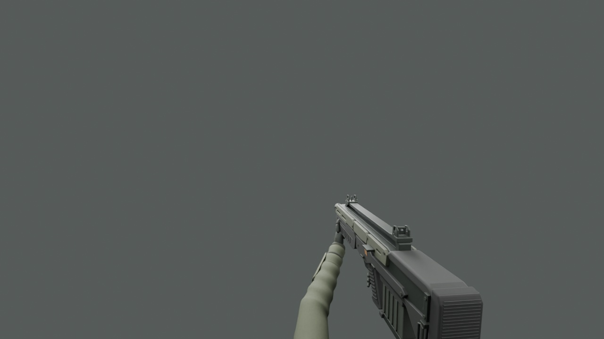

# Marine service-rifle view arms — first authored pass

A skinned first-person marine arm rig for the militia service rifle: olive fatigue sleeves, modeled fabric folds, wrapped wrist guards, dark work gloves and individually articulated fingers. The support hand holds the fore-end and moves to the rear magazine during reload. This remains an initial animation/art pass, not final character art.



## Deliverables

- `MarineServiceRifleView.blend`: editable, self-contained model, 48-bone rig and three baked actions. Opens in Blender 4.5.3 LTS. Texture images are packed.
- `Assets/Harvest/Art/Characters/MarineViewArms/MarineServiceRifleView.fbx`: skinned arms and rifle, six meshes, named Idle/Fire/Reload takes, +Z forward in Unity.
- `MarineArms_Color/Normal/Mask.png` in that asset folder: shared 1024-square arm atlas. Color is sRGB; normal and mask are linear. Mask is metallic R, occlusion G=1, unused B, smoothness A.
- Rifle materials reuse the darker 2K rifle atlas. The world/pickup rifle remains separate and has no arms.
- `Review/Motion.mp4`: actual Blender render at the gameplay camera's 75° vertical FOV, 16:9 and 0.3m near plane. Reload is displayed at the current 1.8-second gameplay duration. This is not a Unity capture.
- `validation.json` and `round_trip_validation.json`: topology, skin and export checks.

The arms contain 16,648 triangles; the detailed rifle adds 62,948. This is an initial first-person mesh budget; it is not a measured Unity performance result. The rig supports this rifle only. Other weapons still use their existing view models.

## Animation behavior

| Clip | Source duration | Presentation |
| --- | --- | --- |
| Idle | 3 seconds, loop | Restrained breathing movement; hands stay on their contact points |
| Fire | 0.2 seconds | Trigger finger and bolt motion; existing root recoil remains in charge of the kick |
| Reload | 2.4 seconds, normalized to weapon timer | Support hand reaches rear magazine, withdraws it below frame, returns with replacement, seats it, and returns to the fore-end |

Arm poses use a two-bone solve baked into bone transforms. No Blender constraints are required in Unity. The fingers close around the narrower magazine during contact. The offscreen magazine exchange reuses the same mesh; no new pickup or ammo behavior is introduced.

`AuthoredWeaponAnimation` samples the imported legacy clips from `MarineLoadout` and `WeaponInstance`. Reload progress follows the current reload deadline, including switching back to a weapon mid-reload. Shots restart the visual firing clip. Disabling a view unsubscribes its shot event; enabling it resets the pose. The existing generic reload bob/rotation is bypassed only for views with an authored reload, avoiding a double transform. No animation events grant ammo or cause damage. Idle, recoil, existing melee translation and gameplay timing remain separate.

## Unity setup and review

1. Pull `prototype/the-line` and let Unity import the assets.
2. Run **Harvest > Art > Build Marine Rifle Arms Review**. Save the current scene when prompted. This builds the materials and animated prefab, then opens a separate camera review scene. Use a 16:9 Game view.
3. Select the FBX in the Project window and preview its Idle, Fire and Reload clips. Check finger contact, normal-map shading and magazine travel.
4. Run **Harvest > Art > Apply Animated Marine Rifle To Prototype**, then rebuild The Line. Only the service-rifle first-person prefab changes; its world model uses the separate rifle-only prefab.
5. In Play mode inspect sustained fire, reload, switching away/back during reload, movement, melee and restart/death. Check the near plane throughout the motion. Generated prefab and material edits are retained on later builds.

Unity is not installed in the authoring environment. C# compilation, Unity's FBX importer, animation sampling, lighting and final Play-mode appearance require Editor verification. The neutral Blender preview cannot establish those results. Sprint, equip, bespoke melee, grenade, damage reactions and other-weapon hand poses are not authored in this pass.

## Rebuild

Use the same `bpy==4.5.3` Python 3.11 environment as the rifle source:

```sh
python build_view_arms.py
python validate_view_arms.py
python render_motion.py
ffmpeg -y -framerate 20 -i Review/MotionFrames/%04d.png -c:v libx264 -pix_fmt yuv420p -movflags +faststart Review/Motion.mp4
```

`build_view_arms.py` regenerates geometry, weights and the arm atlas, then invokes `animate_view_arms.py`. Running `animate_view_arms.py` on its own updates the actions, FBX and review renders from the editable source without rebuilding geometry or rebaking textures. Both overwrite generated outputs; copy the source before hand editing. `MarineServiceRifleReview.blend` and image-sequence intermediates are regenerated locally and excluded from git.
