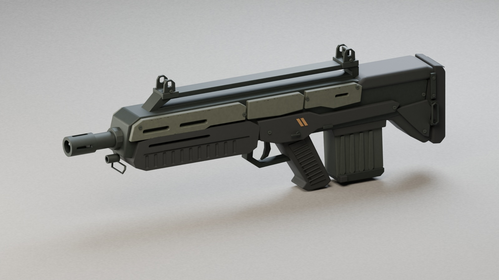
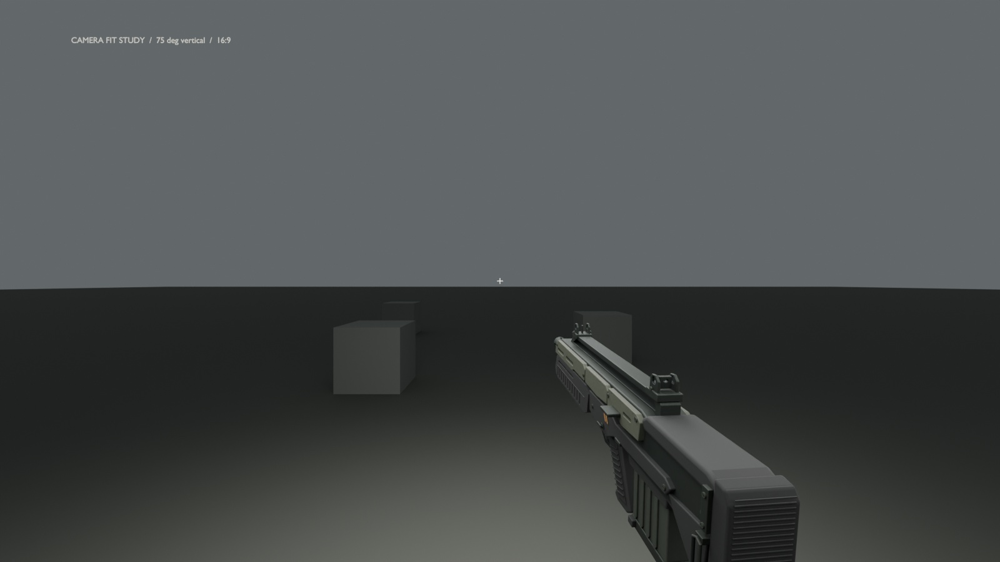

# Militia service rifle — authored asset 02

A fictional exterior prop modeled from the approved Halo: Harvest civilian militia rifle concept. The authored version establishes the long bullpup silhouette, open carry bridge, protected iron sights, recessed-channel polymer handguard, angled pistol grip, rear magazine, shoulder pad and colony inspection markings. It contains no functional internal mechanism.

Revision 02 darkens the palette toward the concept: matte olive-grey panels, charcoal furniture, subdued steel and restrained ochre markings. It replaces raised handguard ribs with recessed channels, slims the sight guards, rounds panel transitions and seats fasteners against their panels.





The first-person image is a Blender camera study using the prototype's 75° vertical field of view and a 16:9 frame. It is not a Unity screenshot.

## Files

- `MilitiaServiceRifle.blend`: editable source with individual components, bevel/normal modifiers, procedural materials, lights and four review cameras. It opens in Blender 4.5.3 LTS. The material nodes need no external textures.
- `MilitiaServiceRifle.glb`: portable model preview with embedded 2K textures; uses the standard Draco mesh compression extension.
- `Review/`: actual Cycles renders of the model, including the baked game-material preview.
- `ApprovedConcept.png`: the approved concept reference.
- `../../../Assets/Harvest/Art/Weapons/MilitiaServiceRifle/`: detailed FBX, static distance FBX, base color, tangent normal, metal/roughness and Unity mask textures.
- `build_rifle.py`, `export_rifle.py`, `validate_exports.py`, `review_view_pose.py`: reproducible modeling, baking/export and round-trip checks.

## Asset specification

| Item | Value |
| --- | --- |
| Length / width / height | 1.055 / 0.161 / 0.359 metres |
| Detailed model | 62,948 triangles, five mesh parts |
| Distance model | 20,142 triangles, one static mesh |
| Export material | One shared material, 2048 × 2048 atlas |
| Detailed parts | Body, Grip, Magazine, Trigger, Bolt |
| Animation preparation | Separate magazine, trigger and bolt with local pivots; separate rifle-only source; animated marine view supplied separately |
| Alignment | Grip-centred root; Unity +Z forward, +Y up |
| Markers | Muzzle, GripAnchor, MagazineAnchor |
| Collision | Visual-only asset; use the existing gameplay pickup/actor collision |

`ServiceRifle_BaseColor.png` is sRGB. Normal, metal/roughness and Unity mask maps are linear. Metal/roughness uses R=1, G=roughness, B=metallic. Unity mask uses R=metallic, G=occlusion (1), B=unused, A=smoothness. The normal map uses the Blender/OpenGL tangent convention. Roughness is currently material-based; color variation, edge detail and fine normal grain are baked from the source. Artist-authored dirt, damage painting and hero close-up polish can build on this version.

The detailed mesh is intended for near views. The distance mesh is an initial reduction for actor/pickup use, not a measured final performance budget. Most small components use actual geometry; subsequent optimization can bake more hardware into normals. The separated parts are used by the optional marine view rig; this rifle-only source remains independent of the character rig.

## Unity review

After pulling:

1. Run **Harvest > Art > Build Service Rifle View Review**. Save any current scene when prompted. This builds/imports the materials and prefabs, opens a separate neutral-lit review scene and checks imported orientation and near-plane clearance at rest and maximum recoil. Select a **16:9 Game view**.
2. Inspect the colors, normal-map shading and first-person framing in Unity. The review uses `ViewPose.json`: local position `(0.32, -0.46, 0.90)`, rotation `(-5, -6, 0)`, vertical FOV `75`, near clip `0.3` metres.
3. Run **Harvest > Art > Apply Militia Rifle To Prototype**, then rebuild The Line to refresh the player model. The menu assigns the detailed view prefab, the world LOD prefab and the authored visual pose to the existing Service Rifle definition. Existing authored NPC held models must be refreshed separately because the scene builder preserves them.

**Harvest > Art > Build Militia Service Rifle Prefab** remains available for asset-only import. It creates a dedicated detailed view prefab without distance LOD switching, plus the existing two-LOD world prefab. Existing material and prefab edits are retained. The shared pose is optional per weapon, so other weapons keep their existing positioning. No damage, firing, recoil or other gameplay values are changed.

The camera study checks actual exported vertices at rest, maximum existing recoil, the lowered reload pose and melee extension. See `view_pose_validation.json` for measured depths and projected bounds. The lower edge can crop during movement as expected for a view model. The optional marine arms and authored animation pass is documented in `ArtSource/Characters/MarineViewArms/README.md`. The rifle-only preview here does not include hands. Unity's review additionally checks conservative mesh bounds at rest and maximum recoil; check the complete motion in Play mode before accepting the fit.

Blender rendering, texture baking and detailed FBX/LOD FBX/GLB round trips were tested. `validation.json` and `round_trip_validation.json` contain measured results. Unity is not available in the authoring environment: C# compilation, Unity imports, in-game appearance, LOD transitions and performance still require Editor verification.

## Rebuild

With the same Blender version installed, run the scripts through Blender background mode, or use the Python module:

```sh
uv venv .venv --python 3.11
uv pip install --python .venv/bin/python bpy==4.5.3
.venv/bin/python build_rifle.py
.venv/bin/python export_rifle.py
.venv/bin/python validate_exports.py
.venv/bin/python review_view_pose.py
```

Run from this directory. Scripts resolve project paths from their own location. `build_rifle.py` regenerates and overwrites the source file and review renders; make a separate copy before hand-editing the model. `export_rifle.py` reads the current source file, so manual geometry edits can be rebaked without running the generator again. Changes to the silhouette require updating the independent expected dimensions in the validation workflow as appropriate. Keep `.blend` sources outside Unity's Assets folder so Unity does not depend on a local Blender install.
